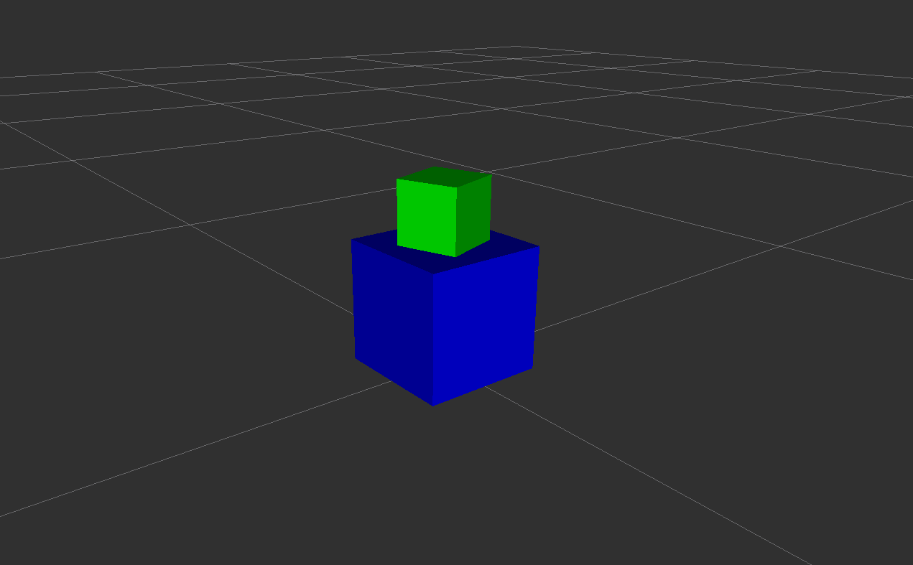

# Robot Description Template

This repository provides a **ROS 2 template package** for creating robot description packages (`*_description`).  
It includes a minimal URDF/Xacro, RViz configuration, launch files, config file, and Docker support through a `Makefile`.



---

## Branches

- **main** → template skeleton (minimal URDF, launch files, and RViz config)  
- **turtlebot3_burger** → example with a real robot description  

---

## Package contents

- `urdf/robot.urdf.xacro` → minimal URDF (blue base + green movable link)  
- `urdf/robot_arguments.xacro` → Xacro arguments (e.g. `green_box`)  
- `launch/robot_description.launch.py` → loads URDF only (no GUI)  
- `launch/robot_view.launch.py` → loads URDF, RViz, and optionally GUI sliders  
- `config/robot_view.rviz` → RViz configuration file  
- `config/robot_components.yaml` → configuration for enabling/disabling components  
- `Makefile` → simplified entrypoint for Docker build & run  

---

## 🛠️ Setup workspace (native)

Create a new ROS 2 workspace and clone this repository:

```bash
mkdir -p ~/robot_ws/src
cd ~/robot_ws/src
git clone https://github.com/vladislav-parkhachev/robot_description_template.git
cd ..
```

Install dependencies:

```bash
rosdep update
rosdep install --from-paths src --ignore-src -r -y
```

Build the workspace:

```bash
colcon build --symlink-install
source install/setup.bash
```

---

## 🚀 Usage with Makefile

The repository provides a `Makefile` for easy usage.  

To build and run the robot description with RViz:

```bash
make run_robot_view
```

This command will:
1. Allow X11 access (`xhost +local:docker`)  
2. Build the Docker image `robot_description:latest`  
3. Run the container with `ros2 launch robot_description robot_view.launch.py`  
4. Revoke X11 access after exit (`xhost -local:docker`)  

👉 No need to remember long `docker` commands — everything is handled by the Makefile.

---

## 🎛 Parameters

- **green_box**  
  Adds/removes an example green link in the URDF:  
  ```bash
  xacro urdf/robot.urdf.xacro green_box:=false
  ```

- **jsp_gui**  
  Launch with GUI sliders for joints:  
  ```bash
  ros2 launch robot_description robot_view.launch.py jsp_gui:=true
  ```

---

## ⚙️ Configuration

Parameters for the robot description can also be stored in `config/robot_components.yaml`.  
This makes it easier to manage different setups without editing URDF/Xacro manually.

Example (`config/robot_components.yaml`):

```yaml
green_box: 'false'
```

Currently supported keys:
- **green_box** → enables/disables the example green link  

You can extend this config with more keys (e.g., sensors, robot variants).

---

## 📌 Notes

- The template shows a simple **blue base link** and a **green movable link**.  
- `base_footprint` is fixed on the ground.  
- The movable link can be rotated using `joint_state_publisher_gui` sliders.  
- Docker + Makefile allow running the template without installing ROS 2 locally.  

Use this as a starting point for your own robot description package 🚀